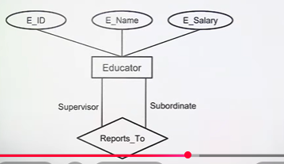
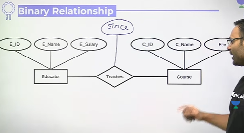
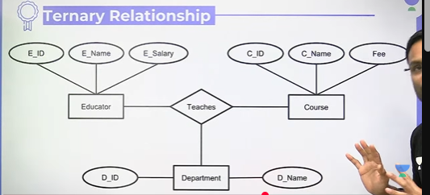
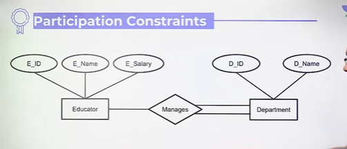
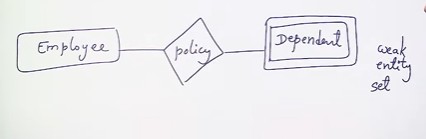

# E-R Modeling
The entity-relationship(E-R) data model consists of a collection of basic objects, called entities, and of relationships among these objects.

* Entity - Object in the real world that is distinguishable from another object
* Entity Set - A collection of similar entities called an entity set
* Attribute - An entity is described using a set of attributes
* Domain - A unique set of values permitted for an attribute
* Relationship - An association among two or more entities
* Relationship-Set - A set of similar relationships
* Key - An attribute or set of attributes whose values can uniquely identify an entity in a set.

# E-R (Entity Relationship) Diagram
1. Entity Set
2. Relationship set
3. Attributes

# Types of Relationships
1. Unary(Relationship between entities of same entity set)
2. Binary(Relationship between entities of 2 entity sets)
3. Ternary(Relationship between entities of 3 entity set)

## Unary Relationship

## Binary Relationship
Basically it means entities of 2 entity sets

* Some attribute will only occur after relationship is made
  * e.g. Ram teaches COA since 2011
  * here time is attribute of relatiship
  * Above is called **Descriptive Relationship**

## Ternary Relationship

## Mapping Cardinality
The maximum number of relationship instances in which an entity can participate

## Mapping Cardinality
1. One to One
   * Citizen has Aadhar card or driving license
2. One to Many
   * Employee manages teams
3. Many to One
   * Bank Account to customer
4. Many to Many
   * Customers buy products

## Participation Constraints
* Specifies the presence of an entity when it is related to another entity in a relationship type
* 2 Types - 
  1. Total Participation
  2. Partial Participation

## Weak vs Strong Entities
A weak entity is an entity that cannot be uniquely identified by its attributes alone

Represent the weak entities in double boxes in above