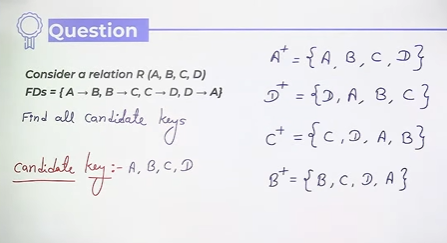
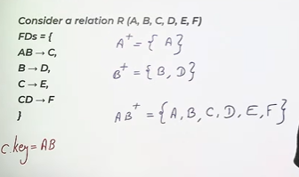
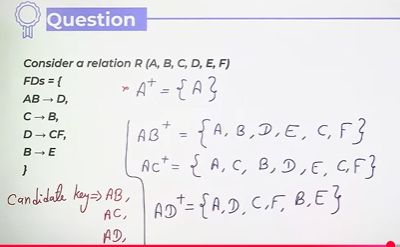
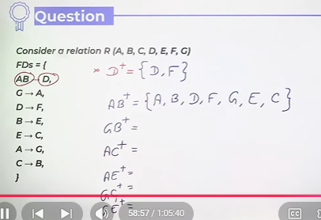

# Finding Keys using functional Dependencies
Try to find an attribute or set of attributes which can derive all the attributes.

* Question1

 

* Question2

* Question3

* **From above if any attribute is not present in the right side of any functional dependency then we will have to take those attributes in the candidates keys for sure.**

* Question4  
Consider a relation R(a,b,c,d,e,f)  
FD's =   
{  
    AB -> D,  
    C -> B,  
    D -> CF,  
    B -> E  
}  

* Question 5

* Question 6

