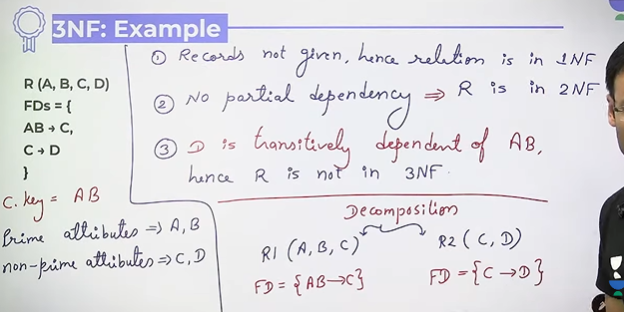
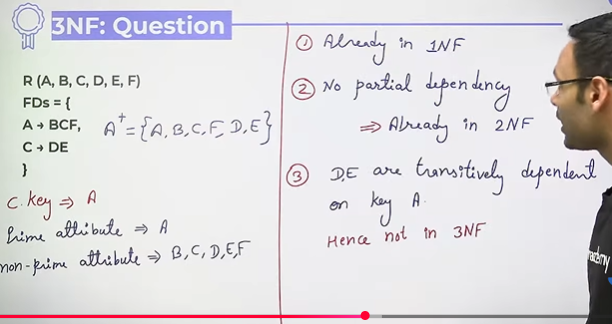
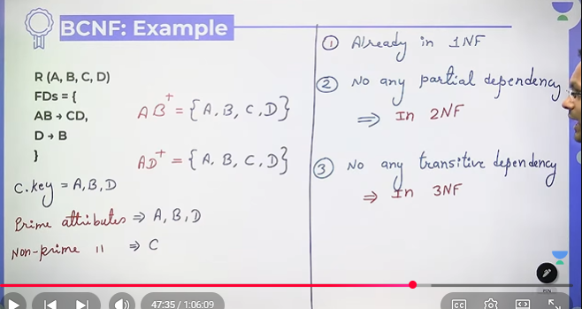
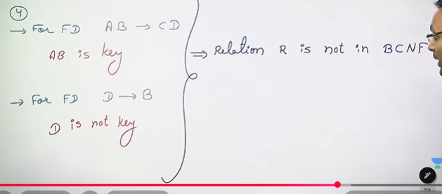
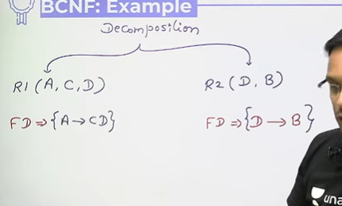

# Normalization in Databases 3NF, BCNF

# 3NF
A relation R is said to be in 3NF if it is already in 2NF and there is no any non-prime attribute in R which is transitively dependent on the key of R

Example 1 -   

* Remove D from original relation and keep it in other relation with C

Example 2 -  

Decompose above  

R(A,B,C,F)  
FD => A -> BCF  
R2(C,D,E)  
FD => C -> DE

Example 3 -  

## BCNF(Boyce Codd Normal Form)
A relation R is said to be in BCNF if it is already in 3NF and for every functional dependency a -> b , a should be super key in R

So to make above BCNF , we need to decomposition 

