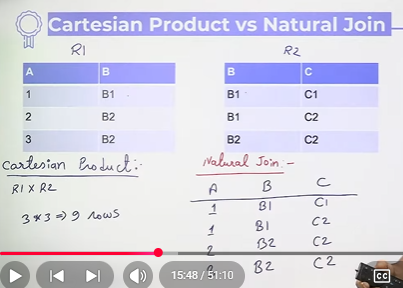
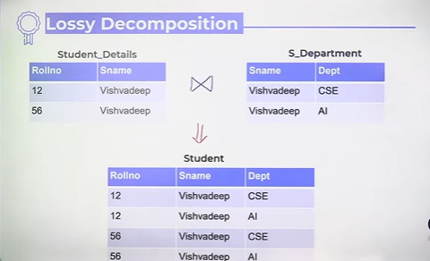
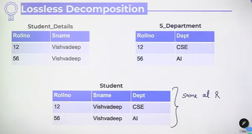
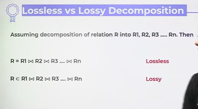
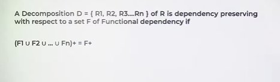
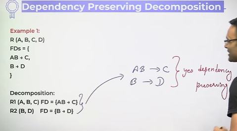
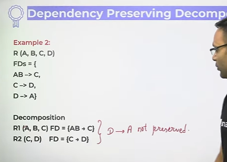

# Lossless & Lossy , FD Preserving Decomposition

## Cartesian Product vs Natuaral Join

* For natural join atleast 1 attribute should be common.

* Why Decomposition is required?
  * To remove anomaly
  * Data of same theme should be in same table

## Lossy Decomposition
The decomposition of realation R into R1, R2, R3 ... Rn is lossy when the join of R1, R2, R3 ... Rn does not produce the same relation as in R.

## Lossless Decomposition
The decomposition of relation R into R1, R2, R3 ... Rn is lossless when the
join of R1, R2, R3 ... Rn produces the same relation as in R.

* Upto 3NF all decompositions are lossless
* BCNF may give lossy decomposition
  * During the normalization process if BCNF is giving you the lossy decomposition then the BCNF decomposition will not be applied

## Dependency Preserving Decomposition

* Example 1 - 

* Example 2 - 

so above is not dependency decomposition preserving

* **Upto 3NF** all decompositions are dependency preserving but **BCNF** may give dependency preserving decompositions or may not give.
* Any relations with 2 attributes is always into BCNF.
  * Because - A 2-attribute relation automatically satisfies 2NF and 3NF because there can’t be partial or transitive dependencies.

