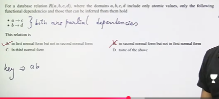
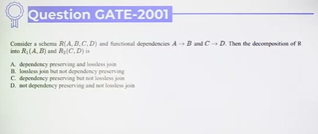

# Normalization | Practice Questions

* Question 1

Prime Attributes = A,B,C  
Non-prime attributes = no any  

therefor above relation is in 3NF because no any prime attribute.

For BCNF - C -> A FD, which is not having LHS as key => not in BCNF

* Question 2

atomic values - no any multivalue

* Question 3

Which normal form is considered adequate for normal relational database design
1. 2NF
2. 5NF
3. 4NF
4. 3NF

Ans - 3NF
* upto 3NF => always lossless and dependency preserving decomposition  
* update, insert, delete anomalies are eliminated

* Question 4 

From above all attributes can be derived from all the other attributes.  
It's like circular dependency  
That means S,T,U,V will be key. And also there are no non-prime attributes

* Question 5

From above there is no loss in dependency. so it is dependency preserving.  

