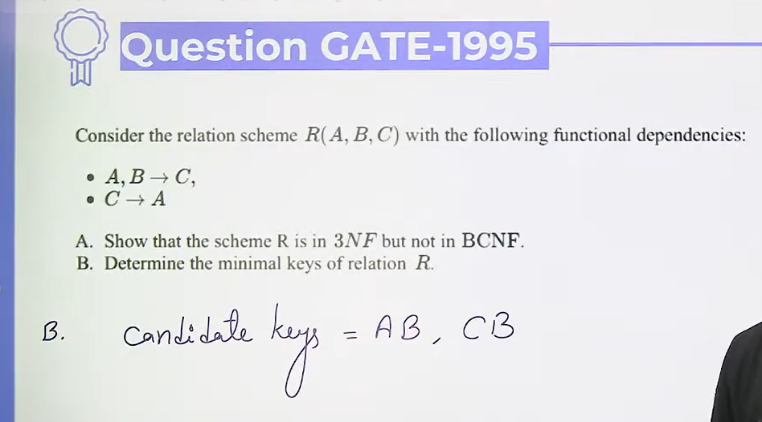
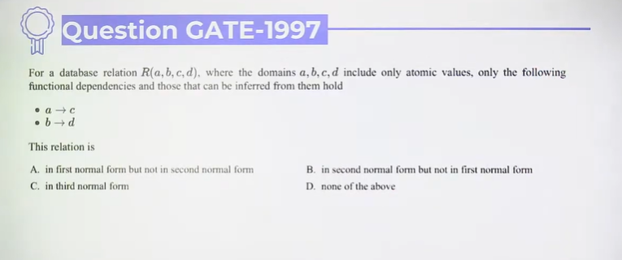

# Normalization | Practice Questions

* Question 1

Prime Attributes = A,B,C  
Non-prime attributes = no any  

therefor above relation is in 3NF because no any prime attribute.

For BCNF - C -> A FD, which is not having LHS as key => not in BCNF

* Question 2

