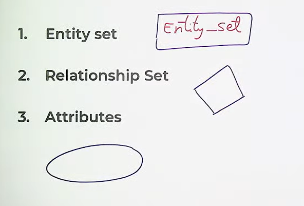

# E-R Modeling
The entity-relationship(E-R) data model consists of a collection of basic objects, called entities, and of relationships among these objects.

* Entity - Object in the real world that is distinguishable from another object
* Entity Set - A collection of similar entities called an entity set
* Attribute - An entity is described using a set of attributes
* Domain - A unique set of values permitted for an attribute
* Relationship - An association among two or more entities
* Relationship-Set - A set of similar relationships
* Key - An attribute or set of attributes whose values can uniquely identify an entity in a set.

# E-R (Entity Relationship) Diagram
1. Entity Set
2. Relationship set
3. Attributes

# Types of Relationships
1. Unary(Relationship between entities of same entity set)
2. Binary(Relationship between entities of 2 entity sets)
3. Ternary(Relationship between entities of 3 entity set)
