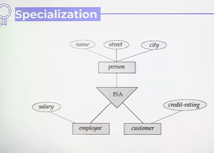
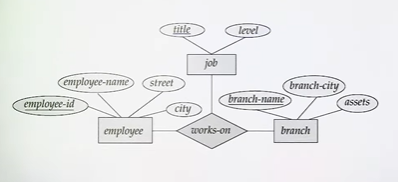
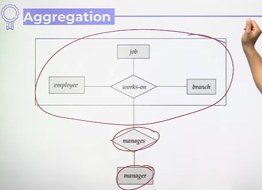

# Types of Attributes in E-R Model

# Extended E-R Features
* Specialization
* Generalization
* Higher-and lower-level entity sets
* Attribute inheritance
* Aggregation

1. **Specialization** - The process of designating subgroupings within an entity set is called specialization



2. **Generalization** - This commonality can be expressed by generalization, which is a containment relationship that exists between a higher-level entity-set and one or more lower-level entity sets

1. Disjoint
2. Overlapping

* **Total generalization or specialization**- Each higher-level entity must belong to a lower-level entity set
* **Partial generalization or specialization** - Some higher-level entities may not belong to any lower-level entity set

## Attributes Inheritance
Attribute Inheritance refers to the mechanism by which a subclass (or subtype) automatically inherits the attributes  
(and relationships) of its superclass (or supertype) in an EER model.
## Aggregation
Relationship-set participating in **relationship then aggregation is used.**

```txt
Aggregation is a concept used in E–R modeling to represent a "relationship between relationships" — i.e., when a relationship itself participates in another relationship.

It is also called a “higher-level abstraction” because it allows us to treat a relationship set as an entity set for the purpose of another relationship.
```





##  Types of Attributes
1. Single valued vs Multivalued attributes
   * Single Valued - Only one value possible of an attribute
   * For multivalued - multiple values possible for an attribute of an entity.
  

* Roll_no - Single valued
* Phone_no - Multivalued

2. Simple vs Composite attributes
* Simple - Cannot be further decomposed
* Composite - can be decomposed to smaller other attributes
  
3. Given vs Derived Attributes
*  Which can be derived from the given attribute. e.g. Age can be derived from Date of birth

4. Prime vs Non-prime attributes
* Prime - Part of key(Key attribute)
* Non-prime key - not part of key (non-key attribute)

Key in above is basically Primary key
