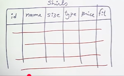

# Relational Model Introduction

# Data model
1. E-R Model
2. Relation model

now let's talk about relational model

## Relational model
The relational model uses a collection of tables to represent both data and the relationships among those data

## Attribute or field
* Attributes are used to describe relations or columns are attributes
* e.g. id, name, size, type, price, fit in the shirt table

## Tuple or Record
A row in a relation

## Instance
Snapshot of the data in the database at a given instant in time

## Database Schema
Logical design of database  
e.g. Relation_name(attribute1, attribute2, ...)  
account(account_number, branch_name, balance)  
branch(branch_name, branch_address)  
employee(e_id, e_name, e_mail, e_address)  

## Domain
* A unique set of values permitted for an attribute

## Domain Constraint
* Specifies an important condition that we want each instance of relation to satisfy

## Degree or Arity
* Number of attributes in relation

## Cardinality
* Number of tuples in a relation

## Relational Database
* A relational database is a collection of relations
* NULL - representation of no value

