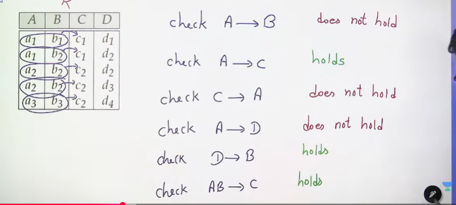
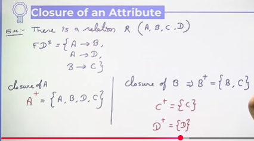
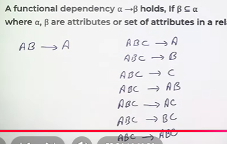
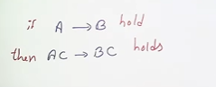
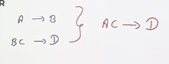
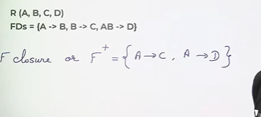
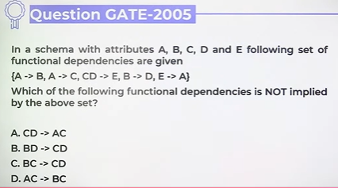
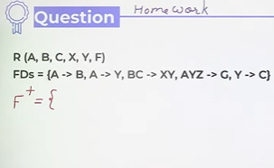

# Functional Dependency & Closure

## Functional Dependency
Consider a relation R and 2 attributes A and B in R.
B is functionally dependent on A(denoted by A -> B), if each value of A is associated with **exactly one value** in B in relation R.

* Functional Dependency (FD) is a relationship between two sets of attributes in a database, where one attribute (or a group of attributes) uniquely determines another attribute.
* A functional dependency can involve a combination of attributes, known as a composite determinant.
  * In functional dependency, the order of attributes on the left-hand side doesn’t matter.

* Why It’s Important:
  * Functional dependencies are used to:
  * Detect redundancy in data
  * Identify candidate keys
  * Apply normalization (like 2NF, 3NF, BCNF)
  * Prevent update, insert, and delete anomalies

* A functional dependency a -> b always holds if 'a' is key in the relation R , where a,b are attributes or set of attributes in R
* Functional dependencies play a key role in differentiating good database designs from bad database designs.
* A functional dependency is a type of constraint that is a generalization of the notion of key
* X -> Y , where X is a set of attributes that can determine the value of Y

# Closure of an Attribute

## Functional Dependency - Trivial
Some functional dependencies are said to be trivial(obvious) because they are satisfied by all relations  
e.g. A -> A

## Armstrong's Axioms
1. Reflexivity Rule
2. Augmentation Rule
3. Transitivity Rule

* **Reflexivity Rule** - A functional dependency a -> b holds, if b ⊆ a where a,b are attributes or **set of attributes in a relation R**

* **Augmentation Rule** - A functional dependency a -> b holds, then ca -> cb also holds where a,b and c are attributes or set of attributes in a relation R

Augumenation means - कुछ extra add करना या जोड़ देना

* **Transivity Rule** - A functional dependencies a -> b and b-> c holds , then a-> c holds, where a,b and c are attributes or set of attributes in a relation R

## Additional Rules
* **Union Rule**
  * A functional dependencies a -> b and b -> c holds, then a -> bc also holds, where a,b, and c are attributes or set of attributes in a relation R
* **Decomposition Rule**
  * A functional dependencies a -> bc holds, then a -> b and b -> c also hold where a,b, c are attributes or set of attributes in a relation R 
* **Pseudo-transitivity Rule** - A functional dependencies a -> b and cb -> d holds then ac -> d also hold, where a,b,c and d are attributes or set of attributes in a realation R

## Closure of a set of Functional Dependencies
with given set of FD's , find all possible FD's from relation  

Find the closure for each option

