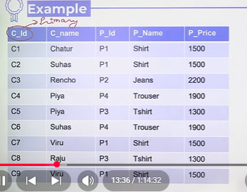
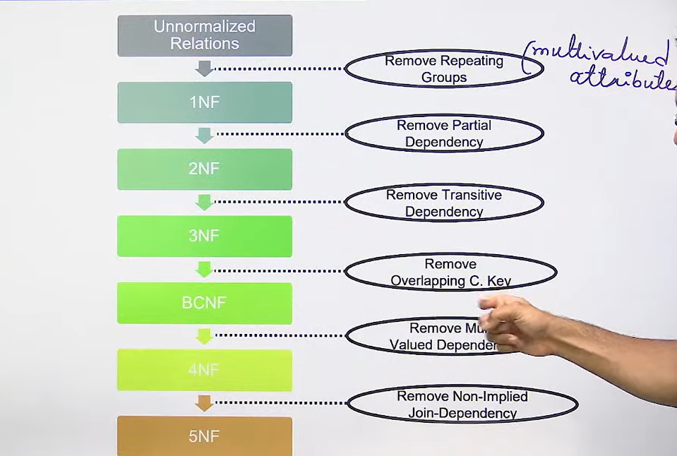
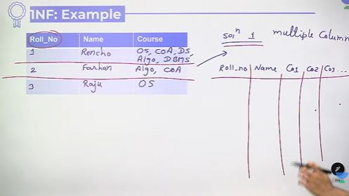
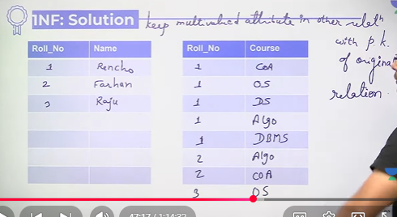
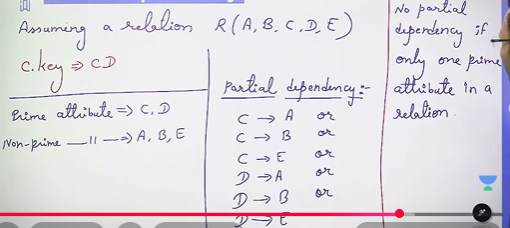
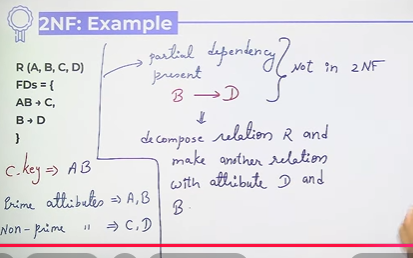
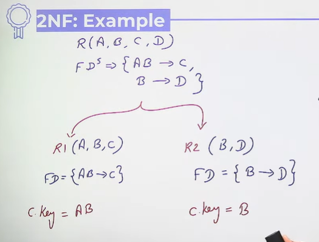

# Normalization in Databases, 1NF, 2NF

## Normalization
Normalization is the process of minimizing redundancy from a relation or set of relations.

* Redundancy in relation may cause insertion, deletion, and update anomalies

Example -  
Customer Table

Delete Anomaly   
Insert Anomaly  
Update Anomaly  

* It is a process of grouping attributes into well structured relations that contain minimum redundancy
* It focuses on characteristics of specific entities

## Essence of Normalization
One relation should have one theme

## Process of Normalization

## 1NF
A relation R is said to be in 1NF if there is **no any multivalued attribute** in R.

* Above with many NULL values, which will lead to space wastage

## 2NF
A relation R is said to be in 2NF if it is **already in 1NF** and there is  
no any non-prime attribute in R which is partially dependent  
prime attribute of R

* Partial Dependency - Assuming a realtion R(A,B,C,D,E)
* If e.g. for above Candidate Key - CD
  * Prime attribute - C,D (जो key का पार्ट है)
  * Non-Prime attribute - A,B,E (जो key का पार्ट नहीं है)

✔ अगर (A,B) composite key है और कोई dependency जैसे A → C या B → D है,  
तो यह partial dependency कहलाती है।  
2NF में ऐसी dependency नहीं होनी चाहिए।  

👉 Partial Dependency = जब non-key attribute पूरे composite key पर depend ना होकर उसके किसी हिस्से पर depend करे।

* So in above there is no partial dependency , so it is in 2NF 

* Question  

