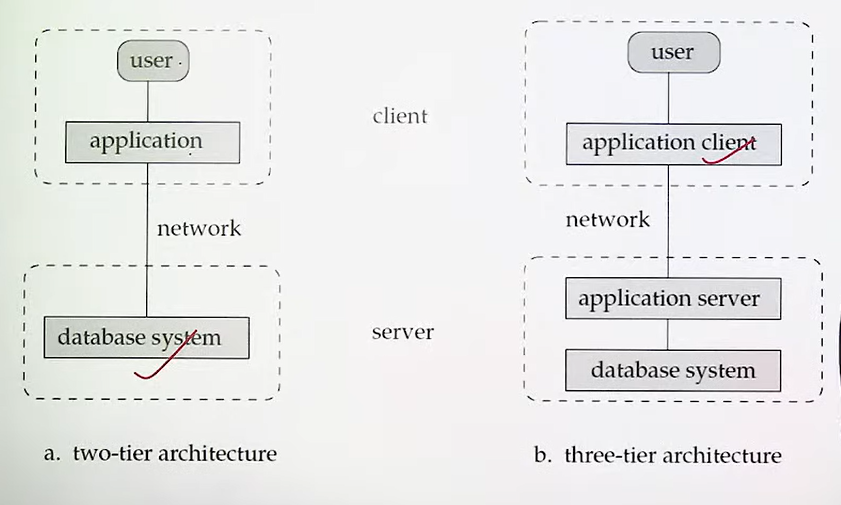

# Database

* What is Data? The collection of data, usually referred to as the database, contains information relevant to an enterprise.
* What is DBMS? A database-management system(DBMS) is a collection of interrelated data and a set of programs to access(retreive, insertion, deletion, updation) those data

## Goal of DBMS
1. Providing a way to store and retrieve database information that is both convenient and efficient.
2. Ensuring the safety of the information.

* "Information is important for most organization"
  * What should we do as CS experts?
    * **Develop a large body of concepts and techniques for managing data**

## Database Applications
* Airlines, Travels, Tours, Hotels, Educationals, Institues
* Finance, Banking
* Needed for Data science and machine learning also

## But Why DBMS?
* Files => Storage => Program => Information
* Disadvantages of File System?
  * Data Redundancy and Inconsistency
  * Difficulty in Accessing Data
  * Data Isolation
  * Integrity Problems(applying constraints)
  * Atomicity Problems
  * Concurrent-Access Anomalies
  * Security Problems

## Instance and Schema
* The collection of inforamtion stored in the database at a particular moment is called an instance of the database
* The overall design of the database is called the database schema

## Database Languages
1. Data-Definition Language(DDL)
2. Data-Manipulation Language(DML)
   1. Procedural DMLs
      * Require a user to specify what data are needed and how to get those data
   2. Non-procedurals(Declarative) DMLs
      * Require a user to specify what data are needed without specifying how to get those data. e.g. SQL

## Database Users and Admins
1. Naive users
2. Application programmers
3. Sophisticated users
4. Specialized users
5. Database Adminstrator(DBA)
   * Maintaining Database, security, Auth, Cleanup process
   * These post are no longer available as due to programme already written which do those work automatically

## View of Data
1. Physical Level
2. Logical Level
3. View Level

## Database System Structure
The functional components of a database system
1. Storage manager
2. Query processor components

## 2-Tier & 3-Tier Architecture

